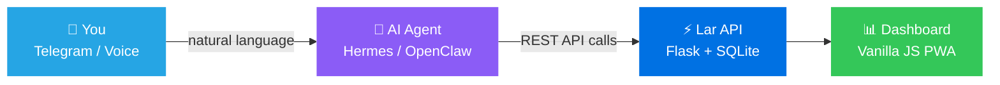
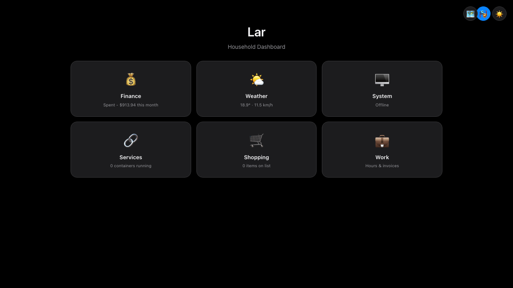
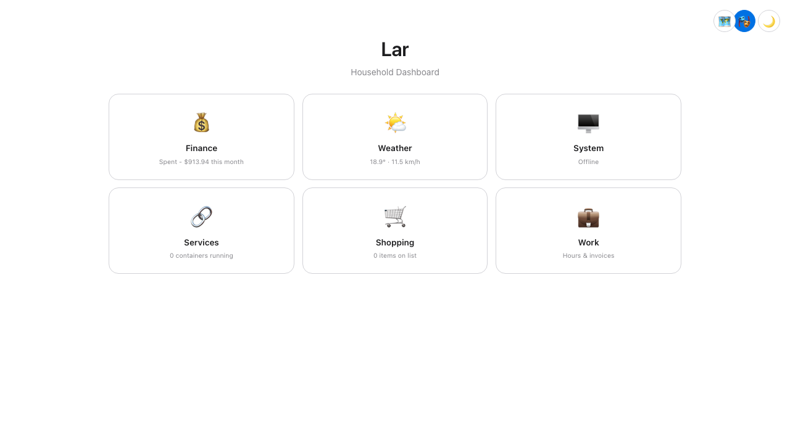
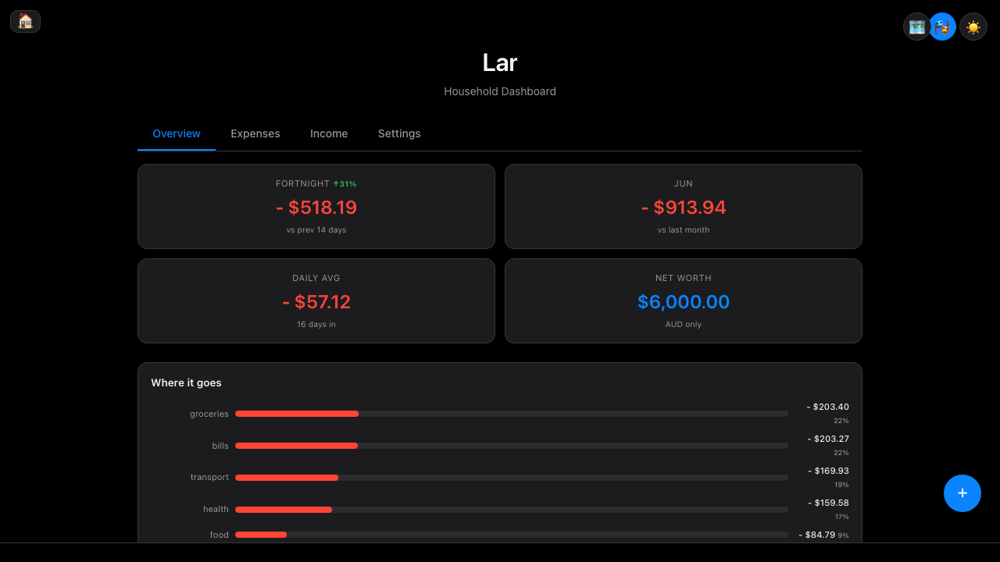
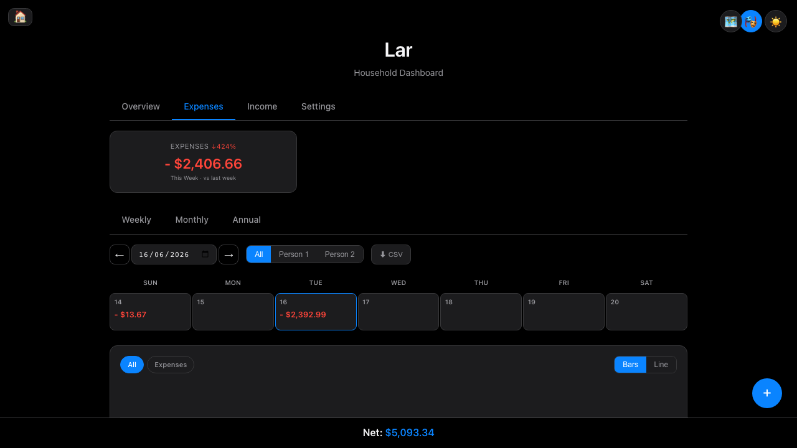
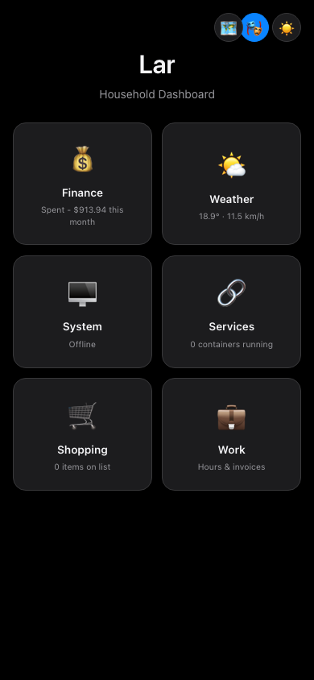

<div align="center">

# 🏠 Lar

**Your household finances, managed by AI.**

*Lar (Portuguese for "home") — a self-hosted finance dashboard where your AI agent is the primary interface.*

[](LICENSE)
[](https://python.org)
[](docker/docker-compose.yml)
[]()
[](https://github.com/danielxb/Lar/commits)
[](https://github.com/danielxb/Lar)

<br>


</div>

<br>

<div align="center">



</div>

---

## 💡 Why Lar?

Most finance apps require you to open them, tap through menus, and manually enter data. **Lar flips this:**

<table>
<tr>
<td width="33%" align="center">
<h3>🤖 Agent-First</h3>
<p>Tell your AI <em>"spent $45 groceries"</em> on Telegram. Done. No app to open, no form to fill.</p>
</td>
<td width="33%" align="center">
<h3>📊 Dashboard for Insight</h3>
<p>Open the web UI when you want charts, trends, and the big picture — not for data entry.</p>
</td>
<td width="33%" align="center">
<h3>🔌 Everything is an API</h3>
<p>Every feature is REST-accessible. Your agent, your scripts, your automations — all first-class.</p>
</td>
</tr>
</table>

<table>
<tr>
<td width="33%" align="center">
<h3>🔒 Privacy-First</h3>
<p>Self-hosted. SQLite. No cloud sync. Your financial data never leaves your machine.</p>
</td>
<td width="33%" align="center">
<h3>⚡ Zero Dependencies</h3>
<p>Vanilla JS frontend, no build step, no node_modules. One Python file backend.</p>
</td>
<td width="33%" align="center">
<h3>🐳 One-Command Deploy</h3>
<p><code>make up</code> — that's it. Docker handles the rest. Port 7777.</p>
</td>
</tr>
</table>

---

## 📸 Screenshots

<div align="center">

| Dark Mode | Light Mode |
|:-:|:-:|
|  |  |
|  |  |



</div>

---

## 🚀 Quick Start

```bash
git clone https://github.com/danielxb/Lar.git
cd Lar
cp .env.example .env    # Configure timezone, location
make up                 # Docker build + run on port 7777
```

### Quick Demo

```bash
# Add an expense
curl -X POST localhost:7777/api/purchases \
  -H "Content-Type: application/json" \
  -d '{"item":"Coffee","amount":-5.50,"category":"Food:Coffee","person":"shared"}'

# Check spending summary
curl "localhost:7777/api/summary?start=2025-06-01&end=2025-06-30"

# Get daily breakdown for charts
curl "localhost:7777/api/daily?start=2025-06-01&end=2025-06-15"

# List all budgets
curl localhost:7777/api/budgets
```

---

## 🤖 AI Agent Integration

> **This is what makes Lar different.** Your AI agent becomes a household finance manager via Telegram — processing natural language, parsing receipts, answering spending questions, and sending proactive alerts.

Lar ships with pre-made skills for **Hermes** and **OpenClaw** agents:

<table>
<tr>
<th>Skill</th>
<th>What your agent can do</th>
<th>Example</th>
</tr>
<tr>
<td><code>lar-quick-add</code></td>
<td>Log expenses via natural language</td>
<td><em>"Spent $45 at Coles on groceries"</em></td>
</tr>
<tr>
<td><code>lar-summary</code></td>
<td>Spending breakdowns on demand</td>
<td><em>"How much this week?"</em></td>
</tr>
<tr>
<td><code>lar-receipt</code></td>
<td>Process receipt photos/PDFs → itemised entries</td>
<td><em>[sends photo of receipt]</em></td>
</tr>
<tr>
<td><code>lar-work</code></td>
<td>Log work hours + income</td>
<td><em>"Worked 7h today, got $165 cash"</em></td>
</tr>
<tr>
<td><code>lar-accounts</code></td>
<td>Account balances & transfers</td>
<td><em>"What's my balance?"</em></td>
</tr>
</table>

```bash
# Setup: copy skills to your agent
cp skills/lar-*.md ~/.hermes/skills/
```

<details>
<summary><strong>📖 Full agent capabilities</strong></summary>

- Adding expenses/income via natural language
- Processing receipts (PDF or photo via vision)
- Answering "how much did I spend on X?"
- Logging work hours with cash/invoice split
- Sending daily weather forecasts
- Weekly spending digests
- Bill reminders when due
- Invoice generation for freelance work

See [`skills/README.md`](skills/README.md) for full setup instructions.

</details>

---

## ✨ Features

<table>
<tr>
<td width="50%" valign="top">

### 💰 Finance
- Expense tracking with natural language quick-add
- Receipt PDF parsing (Woolworths format, extensible)
- Budget management (weekly/fortnightly/monthly/yearly)
- Recurring bills with auto-apply
- Multi-currency accounts + exchange rates
- Savings goals with progress tracking
- Tax export (work-related expenses → CSV)
- Group split for shared expenses
- Spending insights: fortnightly comparison, daily average, category breakdown, day-of-week patterns

</td>
<td width="50%" valign="top">

### 💼 Work
- Hours logging with cash/invoice split
- Invoice PDF generation with carry-forward
- Tip tracking

### 🏡 Home
- Weather forecast (Open-Meteo, no API key needed)
- System monitor (CPU, RAM, disk, Docker)
- Shopping list
- Configurable service links

### 🎨 UI
- Apple-style dark/light mode
- PWA (installable, works offline)
- Responsive mobile-first design
- Canvas charts (zero chart libraries)
- Demo mode for trying without real data

</td>
</tr>
</table>

---

## 🏗️ Architecture

```
Lar/
├── src/
│   ├── server.py              # Flask API — single file, all endpoints
│   └── parsers/               # Receipt PDF parser (extensible)
├── static/
│   ├── index.html             # Single page entry
│   ├── app.js                 # Vanilla JS SPA (~1400 lines)
│   └── style.css              # Apple-inspired design system
├── skills/                    # AI agent skills (Hermes/OpenClaw)
├── scripts/                   # System stats, invoice generation
├── docker/                    # Dockerfile + compose
├── tests/                     # pytest suite (50 tests)
├── data/                      # SQLite DB + uploads (volume-mounted)
├── Makefile                   # Dev commands
└── .env.example               # Configuration template
```

**Design principles:**
- **No frameworks** — vanilla JS, no build step, no node_modules
- **Single-file backend** — one `server.py`, easy to understand and modify
- **API-first** — UI and agents use the same REST endpoints
- **Self-contained** — SQLite, no external services required
- **Privacy-first** — all data stays on your machine

---

<details>
<summary><h2>📡 API Reference</h2></summary>

| Method | Endpoint | Description |
|--------|----------|-------------|
| `GET/POST` | `/api/purchases` | Expenses and income |
| `GET` | `/api/purchases/grouped` | Receipts grouped, singles separate |
| `GET` | `/api/summary` | Period totals + categories |
| `GET` | `/api/daily` | Daily breakdown for charts |
| `GET/POST` | `/api/recurring` | Recurring bills/income |
| `POST` | `/api/recurring/apply` | Apply due items (idempotent) |
| `GET/POST` | `/api/savings` | Account balances |
| `POST` | `/api/transfer` | Transfer between accounts |
| `GET/POST` | `/api/budgets` | Budget limits + progress |
| `GET/POST` | `/api/goals` | Savings goals |
| `GET/POST` | `/api/worklog` | Work hours logging |
| `POST` | `/api/invoices/generate` | Generate invoice PDF |
| `GET/POST` | `/api/shopping` | Shopping list |
| `POST` | `/api/receipt/process` | Parse receipt PDF |
| `GET` | `/api/weather` | Local weather (cached) |
| `GET` | `/api/weather/hourly` | Tomorrow's hourly forecast |
| `GET` | `/api/system` | Host system stats |
| `GET` | `/api/tax-export` | Work expenses CSV |
| `GET` | `/api/roadmap` | Project roadmap |

</details>

<details>
<summary><h2>⚙️ Configuration</h2></summary>

| Variable | Default | Description |
|----------|---------|-------------|
| `TZ` | `Australia/Sydney` | Timezone |
| `PORT` | `7777` | Host port |
| `WEATHER_LAT` | `-33.87` | Weather latitude |
| `WEATHER_LON` | `151.21` | Weather longitude |
| `SECRET_KEY` | `change-me` | Flask secret |
| `WORKER_NAME` | `worker` | Default work log person |

</details>

<details>
<summary><h2>🛠️ Commands</h2></summary>

| Command | What |
|---------|------|
| `make up` | Build & run (Docker) |
| `make down` | Stop containers |
| `make serve` | Run locally (no Docker) |
| `make test` | Run test suite |
| `make backup` | Snapshot database |
| `make logs` | Tail container logs |

</details>

---

## 🤝 Contributing

PRs welcome. The codebase is intentionally simple — one backend file, one frontend file, no build tools. Keep it that way.

## 📄 License

[MIT](LICENSE)
